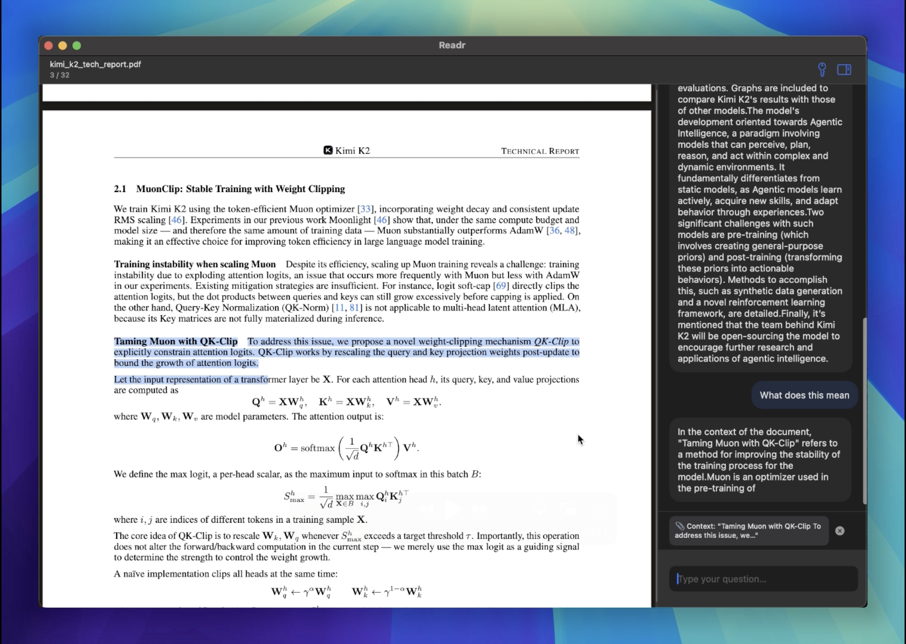

#  Readr

Readr is a macOS app that combines PDF reading with a smart, built-in AI assistant. Ask contextual questions and explore documents in natural language. Bring Your Own Key (BYOK) - Currently OpenAI keys are supported and they are stored securely in Keychain. Check [here](https://help.openai.com/en/articles/4936850-where-do-i-find-my-openai-api-key) on how to find your own API key. 

You can get the download file here: [Readr](https://rohith-gandhi.com/readr) or from the [releases](https://github.com/grohith327/Readr/releases) tab. Anthropic and Gemini integration coming soon

